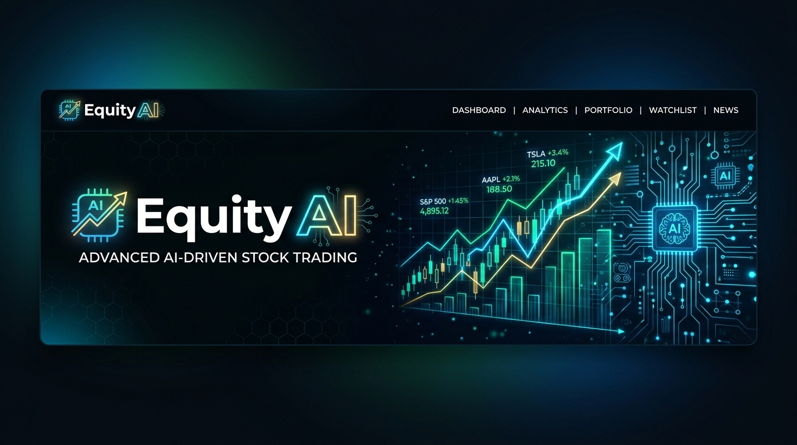

<div align="center">
  
  
  <br />
  <br />

  <h1>Equity AI</h1>
  <p>
    <b>Advanced AI-Driven Fundamental Analysis and Market Intelligence for the Indian Stock Market</b>
  </p>

  <p>
    
    
    
    
    
    
  </p>
</div>

<hr />

## 🌟 Overview

**Equity AI** is a cutting-edge financial technology platform designed to empower investors with deep, AI-driven insights into the Indian equity market (NSE / BSE). By synthesizing real-time financial metrics, charting data, and breaking news, the platform acts as an intelligent, automated portfolio analyst. 

Powered by **Anthropic Claude 3.5**, Equity AI digests vast amounts of complex financial data to generate clear, actionable investment theses in seconds.

## ✨ Key Features

- 🧠 **AI-Powered Theses:** Leverages Anthropic Claude to analyze market data, sentiment, and fundamentals, producing expert-level investment reports.
- 📈 **Real-Time Fundamentals:** Integrates seamlessly with the Yahoo Finance API to pull live pricing, market caps, P/E ratios, and 6-month historical charting data.
- 📰 **Aggregated Market Sentiment:** Automatically fetches and digests the latest news headlines from Google News to provide context to price movements.
- ⚡ **Lightning Fast Backend:** Built natively on **Vercel Python Serverless Handlers** for instant boot times, eliminating traditional middleware overhead.
- 🎨 **Premium UI/UX:** A sleek, glassmorphic dark-mode interface built with React, TailwindCSS, and Framer Motion for a deeply immersive analytical experience.

## 🏗️ Architecture

Equity AI employs a modern, decoupled Monorepo architecture optimized for Vercel:

- **Frontend:** React + Vite SPA, styled with Tailwind CSS and animated with Framer Motion.
- **Backend:** Native Python Serverless Functions (`api/*.py`) providing ultra-fast, zero-config API endpoints.
- **AI Engine:** Direct integration with the `anthropic` Python SDK.

## 🚀 Getting Started

### Prerequisites

- Node.js 18+
- Python 3.9+
- An Anthropic API Key (`ANTHROPIC_API_KEY`)

### Local Development

1. **Clone the repository:**
   ```bash
   git clone https://github.com/praveen0515/Equity-AI.git
   cd Equity-AI
   ```

2. **Install Frontend Dependencies:**
   ```bash
   npm install
   ```

3. **Install Backend Dependencies:**
   ```bash
   pip install -r api/requirements.txt
   ```

4. **Environment Variables:**
   Create a `.env` file in the root directory:
   ```env
   VITE_API_URL=http://localhost:3000/api
   ANTHROPIC_API_KEY=your_claude_api_key_here
   ```

5. **Start the Application:**
   *Note: To run both the React frontend and Python backend locally, we recommend using the Vercel CLI.*
   ```bash
   npm i -g vercel
   vercel dev
   ```

## ☁️ Deployment

This project is perfectly optimized for one-click deployment on **Vercel**. 

Vercel will automatically build the Vite frontend and map the Python scripts in the `/api` directory to serverless edge functions. Just ensure you add your `ANTHROPIC_API_KEY` to Vercel's Environment Variables panel before deploying.

---
<div align="center">
  <i>Engineered for precision. Designed for clarity.</i>
</div>
